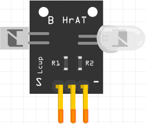

# Raspberry Pi Pico W MicroPython

This repository contains MicroPython code snipped that was developed for **Raspberry Pi Pico W** and each folder holds a stand-alone program.

## Sensor Examples
The following sensors are included in this folder:

Project Name | Sensor | Description
--- | --- | ---
[P1_HelloWorld](./sensor-examples/P1_HelloWorld/) | N.A. | The first program that shows your board programmed successfully with MicroPython
[P2_Blink](./sensor-examples/P2_Blink/) | N.A. | Raspberry Pi Pico W has an onboard LED which this code will test it 
[P3_Push_Button](./sensor-examples/P3_Push_Button/) |  Key Switch Module (Push Button) | Turn on/off onboard LED with push button
[P4_Rotary_Encoder](./sensor-examples/P4_Rotary_Encoder/) |  Rotary Encoder | Print numbers by turning it clockwise/anticlockwise. 
[P5_DHT_11_DHT_22](./sensor-examples/P5_DHT_11_DHT_22/) |  DHT11 | Prints temperature in Celsius and humidity in percentage
[P6_DS18B20_(OneWire)](./sensor-examples/P6_DS18B20_(OneWire)/) | /connection/P6_DS18B20.jpg) DS18B20 Temperature | Scanning 1-wire for all sensors and printing the values in Celsius
[P7_NTC_Thermistor(ADC)](./sensor-examples/P7_NTC_Thermistor(ADC)/) | /connection/P7_NTC_Thermistor.jpg) Analog Temperature | Read the analog value from the thermistor and change it to Celsius
[P8_RG_LED_PWM](./sensor-examples/P8_RG_LED_PWM/) |  Two Color LED | Using PWM to fade LED between green and red
[P9_RGB_LED](./sensor-examples/P9_RGB_LED/) |  RGB LED module | RGB color change in a while loop
[P10_RGB_LED_SMD](./sensor-examples/P10_RGB_LED_SMD/) |  RGB LED SMD | RGB color change in a while loop
[P11_Collision_Detection_Sensor](./sensor-examples/P11_Collision_Detection_Sensor/) |  Collision Sensor | Prints messages with LED indicator when there is an object in its range
[P12_Line_Follower](./sensor-examples/P12_Line_Follower/) |  Line Follower | Prints message while it detects a line different color than the background
[P13_IR_Transmitter_Receiver](./sensor-examples/P13_IR_Transmitter_Receiver/) | IR Receiver & Transmitter | TO DEVELOP… 
[P14_Reed_Switch](./sensor-examples/P14_Reed_Switch/) |  Reed Switch | Print “Magnetic Detected…” to the terminal if there is a strong magnet close to it
[P15_Hall_Sensor_Analog_Digital](./sensor-examples/P15_Hall_Sensor_Analog_Digital/) |  Hall Effect Sensor | Print to the terminal if it catches a magnetic effect
[P16_Joystick](./sensor-examples/P16_Joystick/) |  Joystick | Prints the value and direction of the joystick thumb control and the state of its button
[P17_Heartbeat](./sensor-examples/P17_Heartbeat/) |  Heartbeat Sensor | Prints the ADC value to the terminal
[P18_Active_Piezo_Buzzer](./sensor-examples/P18_Active_Piezo_Buzzer/) |  Active Piezo Buzzer | Beeping and printing the state to the terminal
[P19_Passive_Piezo_Buzzer](./sensor-examples/P19_Passive_Piezo_Buzzer/) |  Passive Piezo Buzzer | Play short songs with passive piezo
[P20_Vibration_Sensor](./sensor-examples/P20_Vibration_Sensor/) |  Vibration Sensor | Detect vibration and prints to the terminal
[P21_Tilt_Switch](./sensor-examples/P21_Tilt_Switch/) |  Tilt Switch | Print On/Off when we rotate the tilt switch
[P22_Knock_Sensor](./sensor-examples/P22_Knock_Sensor/) |  Vibration Shake Sensor | It prints to the terminal when detecting knocking on the sensor
[P23_LDR_Photo_Resistor](./sensor-examples/P23_LDR_Photo_Resistor/) |  Photoresistor | It prints to the terminal and turns on the onboard LED if darkness is more than 70 percent
[P24_Photo_Interrupter](./sensor-examples/P24_Photo_Interrupter/) |  Photo Interrupter | Prints to the terminal if a paper inserted in the middle of it
[P25_OLED_SSD1306_I2C](./sensor-examples/P25_OLED_SSD1306_I2C/) |  SSD1306 | Shows sending texts to the OLED with the I2C port
[P26_PIR_Motion_Sensor_HC-SR501](./sensor-examples/P26_PIR_Motion_Sensor_HC-SR501/) |  Passive Infra-Red | Print to the terminal when detecting motion
[P27_Ultrasonic_Sensor_HC-SR04](./sensor-examples/P27_Ultrasonic_Sensor_HC-SR04/) |  Ultrasonic | Shows the object distance to the module
[P28_Relay_Module](./sensor-examples/P28_Relay_Module/) |  Relay | Turn on/off the relay periodically
[P29_Air_Quality_CCS811_TempHumi_SHT31](./sensor-examples/P29_Air_Quality_CCS811_TempHumi_SHT31/) |  Air Quality | CCS811 prints the CO2 and tVOC and SHT31 prints temperature and humidity
[P30_BME280](./sensor-examples/P30_BME280/) |  BME280 | Prints temperature, humidity, and pressure to the terminal
[P31_BME680](./sensor-examples/P31_BME680/) |  BME680 | Prints temperature, humidity, pressure, and gas to the terminal
[P32_Small_Microphone](./sensor-examples/P32_Small_Microphone/) |  Small Microphone | Prints analog pin value to the terminal and turns LED on on digital pin triggers
[P33_MCP9700_Analog_Temperature](./sensor-examples/P33_MCP9700_Analog_Temperature/) |  MCP9700 | Prints analog temperature value to the terminal

## Network Examples
To ADD… 
