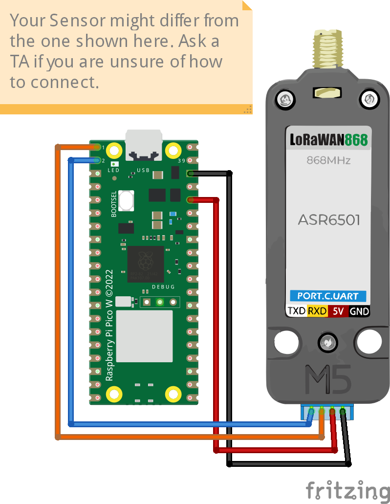

# LoRaWAN connection on Raspberry Pi Pico W with M5Stack LoRa module
The code is based on [Part 2: LoRaWAN on The Things Stack (TTS)](https://hackmd.io/@lnu-iot/rJ9xnMfw2) and [Part 2: LoRaWAN on Helium](https://hackmd.io/@lnu-iot/H1z3FYQP2) tutorials, shows how to connect and transmit values to a LoRaWAN application server. 

## Credits
`**LoRaWAN.py**` library developed by [**David Mozart**](https://github.com/davmoz) at LNU in Kalmar.
`**M5Stack**` Fritzing part created by [**CJ**](https://github.com/DorvoG). 

