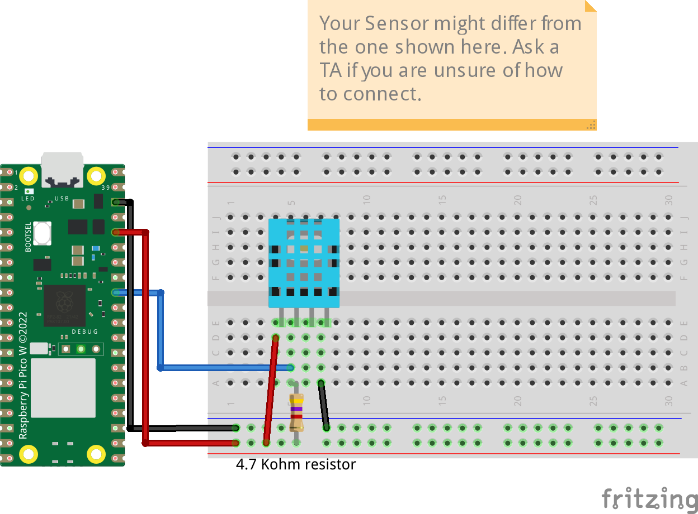

# DHT11 and DHT22 Temperature and Humidity Sensor
The code prints temperature in Celsius and humidity in percentage from DHT11 and DHT22. Depending on what DHT11 you hold you must choose one of the following connections. If your DHT11 is mounted on a PCB you just connect it to the RPi if it comes with four pins then you need to use a 4.7K ohm resistor for stable reading.

