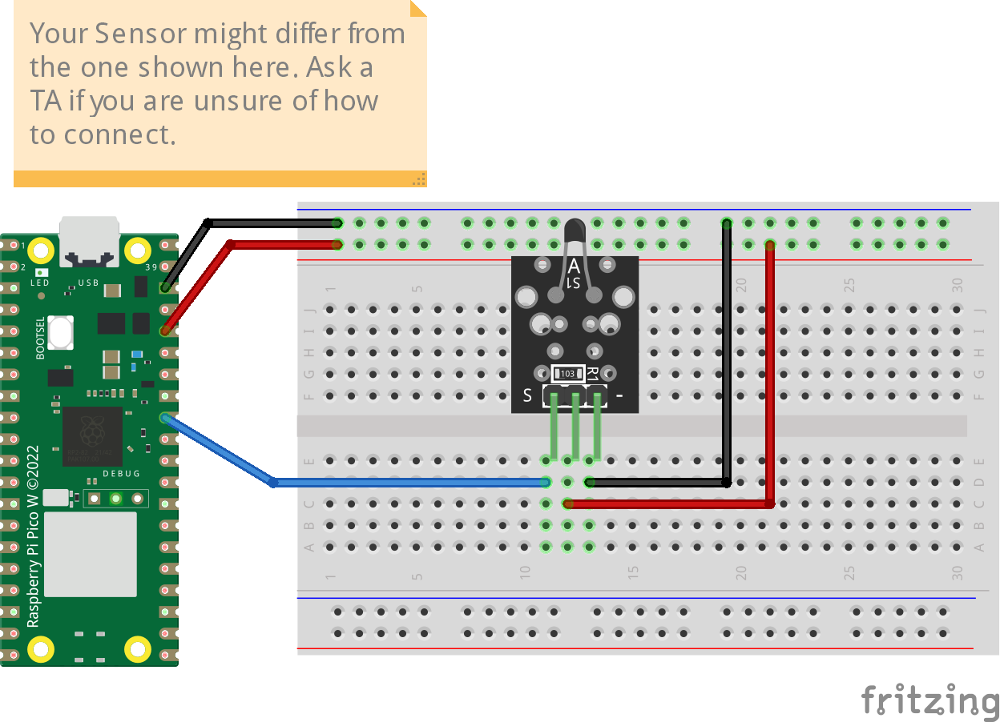

# NTC Thermistor (ADC conversion)
The code prints the sensor analog value and its conversion to Celsius, the reading will be stable after about 20 readings.
 
## Credits
This code adopted from [Bhavesh Kakwani](https://bhave.sh/micropython-measure-temperature/).

